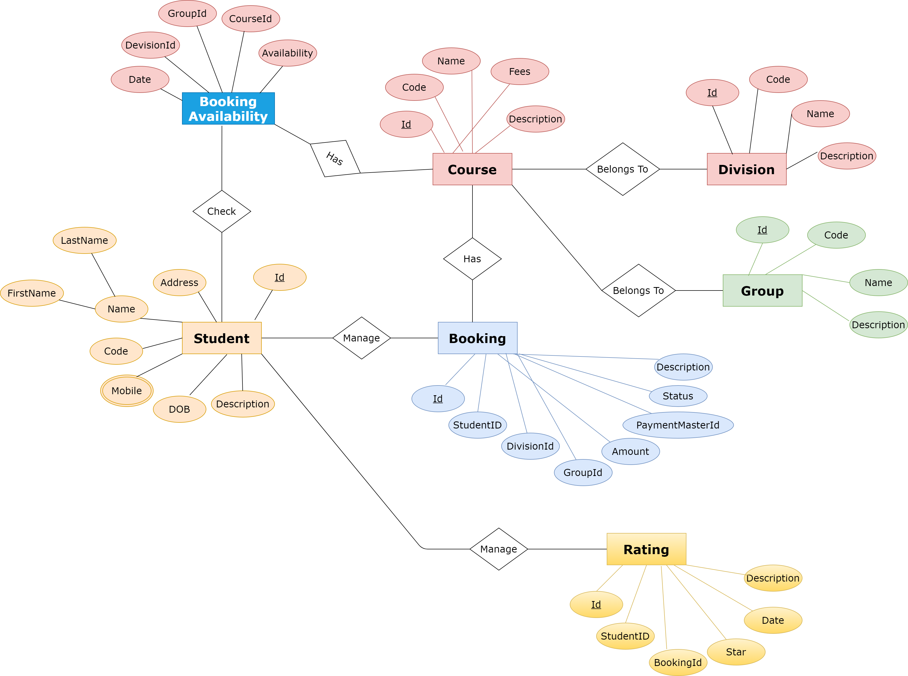

# Course Management System
The University Sports Centre (USC) requires an online course management system to manage the bookings of group exercise courses made by students. 
It must keep track of the price of each lesson, its rating, the timetable of the lessons, and the available slot for a certain day, time, and lesson. 
Manually managing this is really difficult.
The Online Course Management system was created to computerize and automate the processes related to the student's booking issues, rating, and all other operations.

## Aims and objectives of this project

- Check the course timetable.
- Book a course.
- Change a booking.
- Cancel the future booking.
- Provide a numerical rating.
- Write a review.
- Search availability of course and time.
- Facility to generate the monthly reports. (Monthly lesson report and Monthly champion exercise report)

## ER Diagram

  

 
